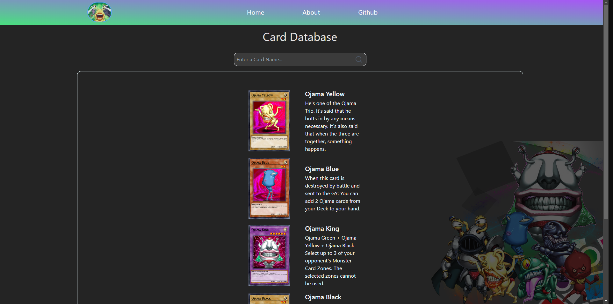
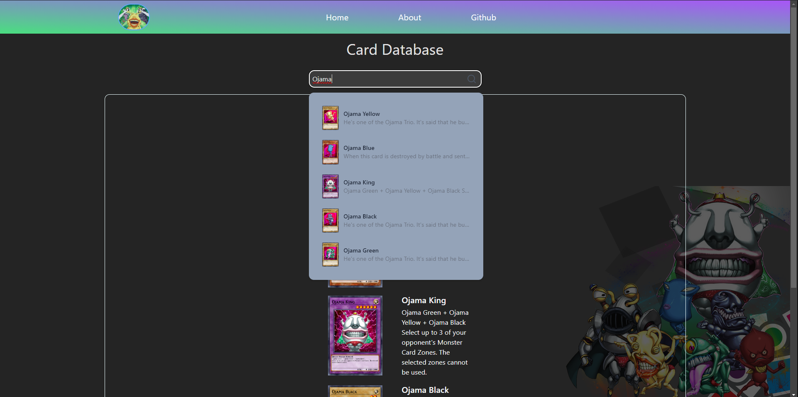
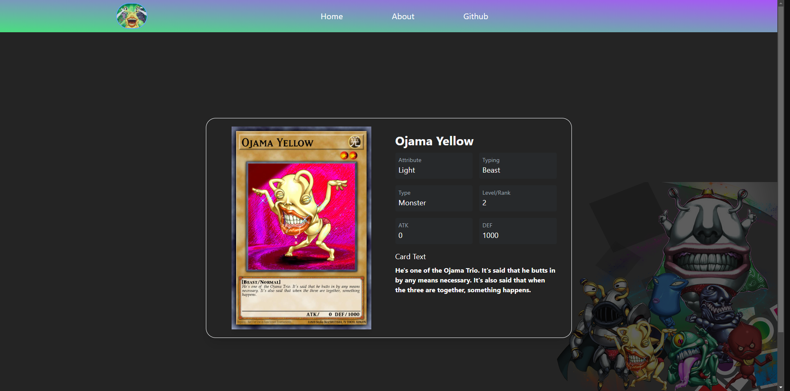

# Yu-Gi-Oh Card Database

## Description

When you load the page, you get an overview of all the cards:

Additionally, you have the ability to search for specific cards:

And if you select a card, you can view its stats:

## Installation

First, clone the backend for this website: https://github.com/parwarr/yugioh-search-engine-demo-

Then, clone this repository.

Run `npm install`

Run `npm run dev`

There you go! :D
